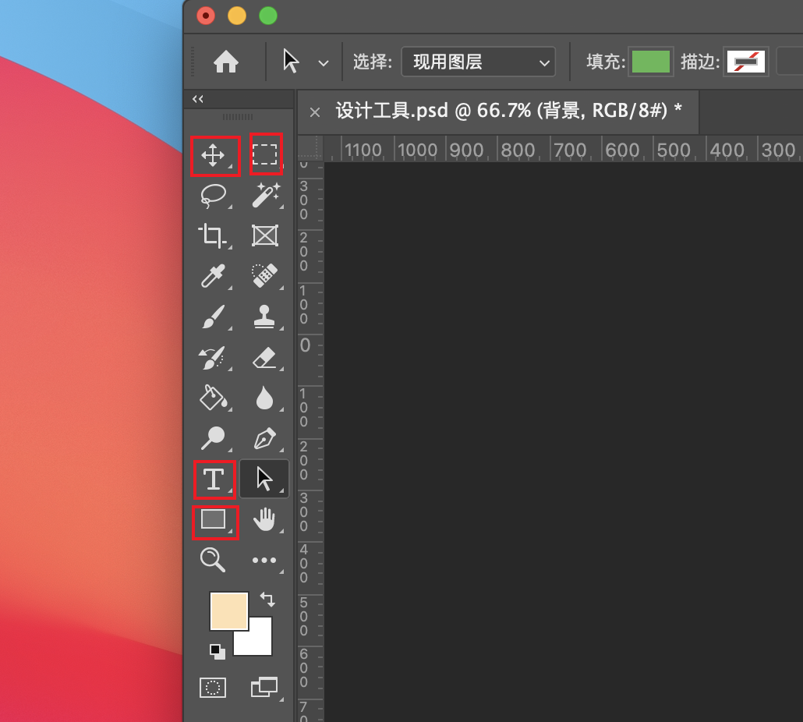

# 设计工具

设计主要用到 Adobe Photoshop 和蓝湖，Adobe Photoshop 也就是我们常说的P图软件 PS，蓝湖主要用来标注，UI设计师标明设计稿上各元素具体的宽高、字号、颜色...，前端开发再根据标注图来开发页面。

## Adobe Photoshop 常用功能介绍

### 软件界面介绍

Photoshop 的操作界面主要分为一下5大块：
* 顶部：菜单栏
* 第二栏：属性栏
* 左侧：工具栏
* 中间：画布区
* 右侧：浮动面板

UI设计中我们主要会用到下面的工具栏、画布区、浮动面板这3块区域。

如果把我们比作一个画家，那工具栏就相当于我们的绘画工具箱，里面装了画笔、橡皮擦、尺子、颜料...这些，我们需要什么工具，就直接从工具箱里拿出来。

画布区就相当于我们要绘画的纸（或者画板），我们用从工具箱里拿出来的笔将想画的图案绘制在画纸上。

浮动面板这一栏倒是不好用现实世界中的绘画来比喻，这一栏稍微有点抽象。在现实中如果我们画了一朵花，但是画好后觉得不好看或者太大了，我们只能擦掉或者换一张纸重新画。在PS里，我们却可以后面再直接对这朵花的颜色、形状、大小进行任意的调整，而不需要重新绘制。

因为当我们用左边的工具在画布上画了一朵花时，PS软件会自动在右边的浮动面板-图层里新建一个“花”的图层，它对应的就是画布上的那朵“花”，我们在“花”的图层上加个投影或者直接删掉这个图层，中间画布区的“花”也会跟着一块自动变化。

### 常用工具介绍

UI设计中我们主要会用到工具栏中的以下4组工具：

#### 移动工具
移动工具位于工具栏中的第一个，从它的位置上应该就能看这个工具的日常地位。形状是一个带小三角尖头的十字形，我们可以用它来任意移动画布上的元素。

#### 矩形选框工具
排第二的就是矩形选框工具，一个虚线边框的矩形图标，我们可以用它来框选我们需要选中的区域，一般多用于图片区域选择。比如我们要插入一张图片，但是🈶️只想要中间的一部分，就可以用这个工具框选出照片中间的部分。

#### 文字工具
一个大写T字母图标的就是文字工具，用它可以来绘制我们需要的文字或段落。

#### 矩形工具
矩形工具的图标是一个白色边框的矩形，里面除了矩形还有椭圆、三角形、多边形、直线、自定义形状工具，我们这个通过这组工具来绘制想要的形状或者一些简单的图标。

相关教程：
* [Photoshop 官方快速入门](https://helpx.adobe.com/cn/Photoshop/get-started.html)
* [Photoshop 官方教程](https://helpx.adobe.com/cn/Photoshop/tutorials.html)

## 蓝湖介绍
[蓝湖](https://lanhuapp.com/)是一款高效的产品设计协作平台，我们主要用它来配合PS完成界面标注和切图工作。

以前没有这类软件的时候，UI设计师设计好界面后，需要自己额外再手动在设计稿上，画个红色线条箭头来标明一些尺寸、字号、颜色...切出一些页面上需要的小图标这些，有了蓝湖这部分体力活就可以交给软件自动完成了。

#### 安装插件
直接到[蓝湖](https://lanhuapp.com/)官网，点击顶部菜单栏的下载-Photoshop插件，选择对应的系统和版本下载，示例教程用的 Photoshop 2021 mac 版，直接下载CEP版本安装包，本地解压后直接点击安装。

关闭PS重启后就可以在窗口-扩展里面看到蓝湖了，同时右侧浮动面板最左边也会出现蓝湖的小图标，直接点击图标就可以出现蓝湖插件的操作界面。

然后登录账号，账号和团队这些信息可以提前在蓝湖官网进行注册和设置好，然后上传画板。

接下来再登录到蓝湖官网上，同一个团队的前端开发就可以看到你刚上传的设计稿，并可以直接根据上面的自动标注进行开发。

相关教程：
* [蓝湖官网](https://lanhuapp.com/)
* [PS 插件上传问题](https://support.lanhuapp.com/503e/9784/f5e6/cda0)